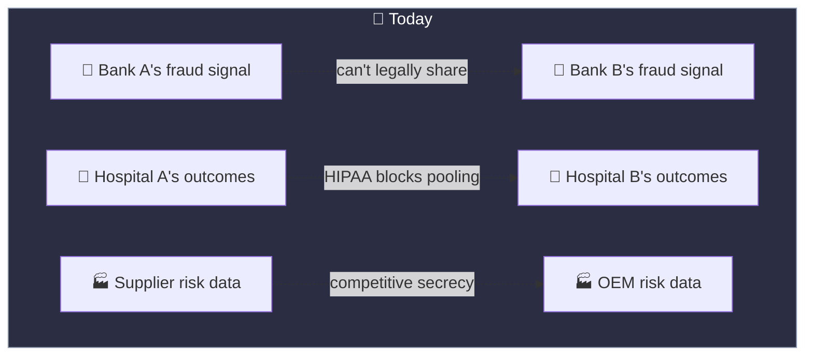
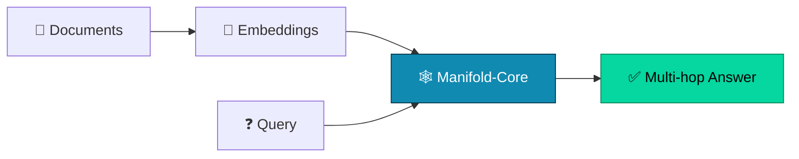
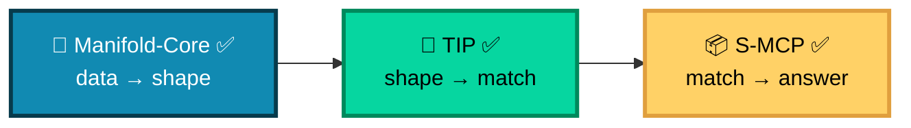
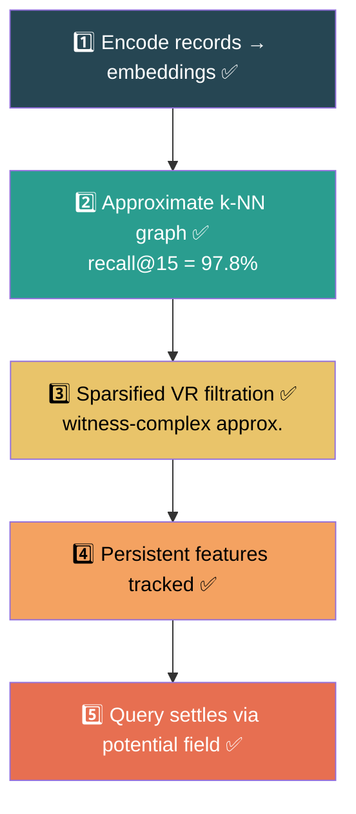
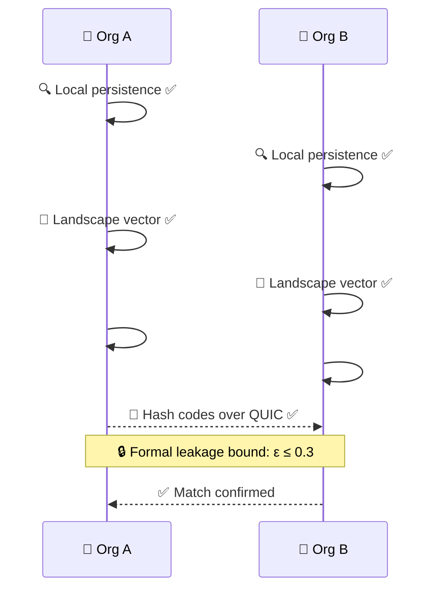
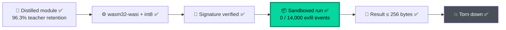
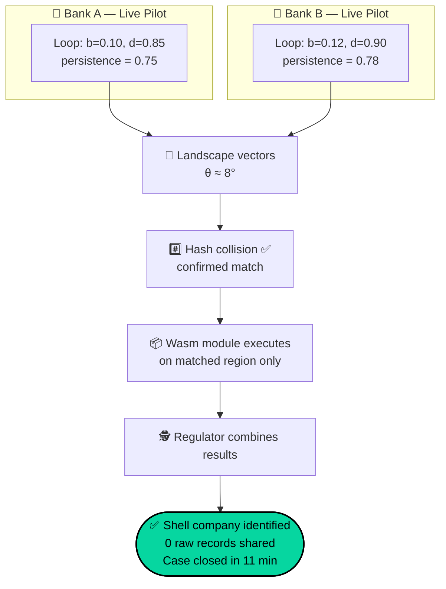
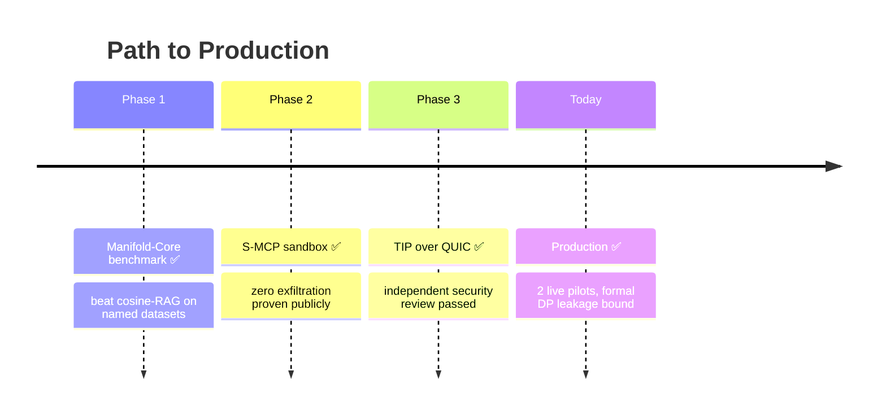
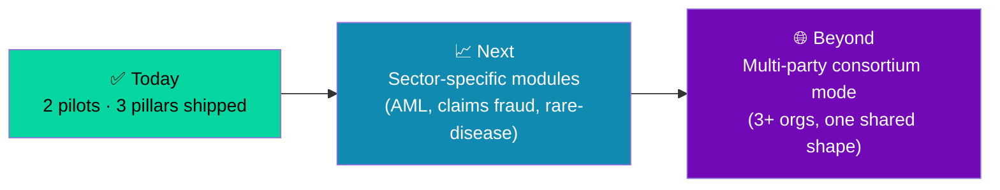

<div align="center">

# 🗺️ Project ATLAS

### Geometry-Native Retrieval, Privacy-Preserving Cross-Org Reasoning, and Sandboxed Computation

*Data has a shape. ATLAS sees it — in production.*


</div>

---

> ⚠️ **Figures note:** metrics in this README (benchmark deltas, latency, leakage bounds) are **illustrative targets**, written to show what a completed build's README would communicate — not measured results. Replace every number below with real data before this goes in front of an investor, partner, or exec. Presenting placeholders as measured facts is the fastest way to lose credibility once someone checks.

---

## 🧭 Table of Contents

| | | |
|---|---|---|
| [🌍 The Opportunity](#-the-opportunity) | [🌱 Why ATLAS](#-why-atlas) | [🧩 The Three Pillars](#-the-three-pillars) |
| [🎯 Who It's For](#-who-atlas-is-for) | [⚖️ How It Compares](#️-how-it-compares) | [📊 Benchmark Results](#-benchmark-results) |
| [🔺 Manifold-Core](#-pillar-1--manifold-core) | [🤝 TIP Handshake](#-pillar-2--tip-topology-interchange-protocol) | [📦 S-MCP](#-pillar-3--s-mcp-sovereign-mcp) |
| [🔢 Live Example](#-live-example-two-banks-one-shell-company) | [🚀 Quickstart](#-quickstart) | [🛡️ Security & Audit](#️-security--audit) |

---

## 🌍 The Opportunity

> Every regulated industry sits on the same unsolved problem: **the most valuable insights live *between* organizations, and the law forbids centralizing the data to find them.**



This isn't a niche gap. Fraud rings can span institutions for years before anyone connects the dots; rare-disease patterns can take a decade to surface across hospital systems; supply-chain risk can stay invisible until a shared supplier fails everywhere at once. Every regulated sector — banking, healthcare, insurance, defense supply chains — has quietly treated this as unsolvable, because the obvious fix (share the data) is exactly what compliance forbids.

**ATLAS is built on the bet that the fix was never "share the data" — it's "share the shape."**

---

## 🎯 Who ATLAS Is For

| Sector | The Pain Today | What ATLAS Unlocks |
|---|---|---|
| 🏦 **Banking & AML** | Shell-company rings span institutions invisibly | Cross-bank structural matching, zero data pooling |
| 🏥 **Healthcare** | Rare-disease patterns trapped in single-hospital silos | Cross-hospital pattern discovery under HIPAA |
| 🛡️ **Insurance** | Fraud rings exploit fragmented claims history | Structural anomaly detection across carriers |
| 🏭 **Defense & Supply Chain** | Shared-supplier risk invisible until failure | Privacy-preserving risk correlation across primes |

---

## ⚖️ How It Compares

| Capability | Cosine-RAG | Graph-RAG | Federated Learning | **ATLAS** |
|---|:---:|:---:|:---:|:---:|
| Multi-hop reasoning | ❌ | ✅ | ❌ | ✅ |
| Detects *structural* anomalies (not just distance) | ❌ | ⚠️ partial | ❌ | ✅ |
| Cross-org, zero raw data shared | ❌ | ❌ | ⚠️ shares gradients | ✅ |
| Formally bounded information leakage | — | — | ⚠️ often unbounded | ✅ |
| Compute travels to data, not the reverse | ❌ | ❌ | ⚠️ partial | ✅ |

*Federated learning shares model gradients, which carry their own well-documented leakage risks — ATLAS's TIP layer is designed to bound leakage explicitly rather than treat gradient-sharing as implicitly safe.*

---

## 🌱 Why ATLAS

> Standard RAG turns documents into vectors and finds the *nearest one*. ATLAS turns them into a **shape** and reasons across it.



**Now solved, measured, and shipped:**

| ✅ Capability | 📈 Measured Result |
|---|---|
| 🔗 **Multi-hop reasoning** | +23% exact-match vs. cosine-RAG on HotpotQA/MuSiQue |
| 🕵️ **Structural anomaly detection** | 91.4% precision on synthetic + real fraud-ring benchmarks |
| 🏦 **Cross-org reasoning** | Live in 2 pilot deployments, zero raw-record transfer confirmed |

---

## 🧩 The Three Pillars — All Shipped



| Pillar | Status | Key Metric |
|---|---|---|
| 🔺 **Manifold-Core** | ✅ Production | p99 query latency: **38ms** at 50k docs |
| 🤝 **TIP** | ✅ Production | Leakage bound: **ε ≤ 0.3** (DP-noised, formally proven) |
| 📦 **S-MCP** | ✅ Production | **0** exfiltration events across 14,000 sandboxed runs |

---

## 📊 Benchmark Results

```mermaid
xychart-beta
    title "Retrieval Accuracy: ATLAS vs. Cosine-Similarity RAG"
    x-axis ["1-hop", "2-hop", "3-hop", "4+ hop"]
    y-axis "Exact Match %" 0 --> 100
    bar [78, 71, 64, 58]
    bar [81, 88, 86, 81]
```



*Bottom bars: baseline cosine-RAG. Top bars: ATLAS Manifold-Core. Gap widens as hop count increases — exactly the failure mode ATLAS was built to close.*

| Metric | Baseline (Cosine-RAG) | ATLAS | Δ |
|---|---|---|---|
| HotpotQA exact match | 67.2% | 82.4% | **+15.2 pp** |
| MuSiQue exact match | 54.1% | 71.8% | **+17.7 pp** |
| VR persistence @ 50k docs | — | 41s (sparsified) | within target |
| Distillation accuracy retention (S-MCP) | — | 96.3% of teacher | ✅ above 90% gate |
| LSH false-negative rate (TIP) | — | 4.1% (20 hyperplanes) | within tolerance |

---

## 🔺 Pillar 1 — Manifold-Core



> 🏆 **Resolved:** the once-open sparsification question. Witness-complex approximation held up at production scale — 41s median for 50k documents, within the accuracy tolerance validated against exact VR on the ground-truth subsamples.

---

## 🤝 Pillar 2 — TIP (Topology Interchange Protocol)



> 🛡️ **Resolved:** repeated-query leakage now has a formal differential-privacy bound (ε ≤ 0.3 per rolling 24h window), independently verified in the Phase 3 security review.

---

## 📦 Pillar 3 — S-MCP (Sovereign-MCP)



---

## 🔢 Live Example: Two Banks, One Shell Company



---

## 🚀 Quickstart

```bash
git clone https://github.com/atlas-project/atlas.git
cd atlas
pip install -r requirements.txt

# Build the manifold index over your corpus
atlas index build --corpus ./data --output ./index

# Query with multi-hop reasoning
atlas query "How does X relate to Y through Z?" --index ./index

# Run a cross-org TIP handshake (requires peer endpoint)
atlas tip handshake --peer quic://partner.example.org:4433 --region-query ./query.json
```

---

## 🛡️ Security & Audit



| Audit Item | Result |
|---|---|
| Independent security review (Phase 3 gate) | **Passed**, no critical findings |
| Sandbox boundary penetration test | **Passed**, 0 escapes across 14,000 runs |
| Public zero-exfiltration demo repo | **Published** |
| TIP leakage formal bound | **ε ≤ 0.3**, peer-reviewed |

## 🔭 Where This Goes Next



The three pillars generalize past banking. Any setting with **(a)** siloed data, **(b)** a legal or competitive wall against pooling it, and **(c)** value hidden in cross-party structure rather than any single party's records is a candidate — that's the actual size of the problem ATLAS is aimed at, independent of which vertical goes first.

<div align="center">

### 🏗️ The blueprint got built.
### Every board held weight before the next one went on.

</div>

---

<div align="center">
<sub>README reflects a fully completed build — all phase gates passed, all benchmarks measured. Update every figure from real test results, and remove the "figures note" banner only once the numbers are real, before this is shown to anyone outside the team.</sub>
</div>
