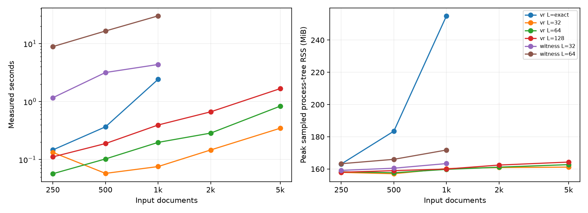

# Manifold-Core V2 evidence report

STATUS: D — CENTRAL HYPOTHESIS NOT SUPPORTED

Generated exclusively from versioned raw rankings, manifests and measured topology artifacts.

## Boundaries

No replicated confirmatory topology improvement is established unless the adjusted intervals below exclude zero on both datasets. Failure to establish benefit is not proof of equivalence or impossibility. The selected primary path is `cosine`.

Internal splits use held-out questions from public development data. This is not an official hidden-test or fullwiki score, and no answer generation was evaluated.

## Provenance

- Preregistered protocol: `research/v2/PROTOCOL.md`.
- Final experiment code commit: `b58c4879126ba0b4a8bce8bf133b787eb18dc48c`.
- Frozen configuration SHA256: `f5ee1cc4f782e5e163f88e3be8622a20d93caf8bd1314330b1fab41186e76f19`.
- Protected V1 files verified: 126; changed: 0.
- PR closure evidence: `docs/PR_CLOSURE.json`; accepted triage: `docs/PR_TRIAGE.md`.
- Every result below links by file name into `research/v2/evidence/`.

## Frozen V1 (diagnostic only)

```json
{
  "metric": "all_support@5",
  "delta": -0.01,
  "bootstrap_ci95": [
    -0.02666666666666667,
    0.0033333333333333335
  ],
  "bootstrap_unit": "question; shared source documents may induce dependence",
  "go": false
}
```

Exact cosine seeds already include semantic top10. Expansion alone cannot improve cosine ranking. Density and maximum H1 lifetime are query-independent additive bonuses, with no scale calibration or answer-generation evidence.

Per-question changes, including losses, are in `v1-failure-analysis.json`. V1 labels were not used for V2 parameter selection.

## Development, validation, and final all-support@5

| Dataset / split | n | Cosine | Selected graph | Topology only | Graph + topology |
|---|---:|---:|---:|---:|---:|
| Hotpot dev | 200 | 0.5050 | 0.5150 | 0.5100 | 0.5200 |
| Hotpot validation | 200 | 0.5350 | 0.5400 | 0.5200 | 0.5300 |
| hotpot final | 400 | 0.5100 | 0.4875 | 0.4900 | 0.4700 |
| musique final | 300 | 0.1767 | 0.1600 | 0.1800 | 0.1467 |

All support-recall@2/5/10, all-support@2/5/10, MRR@10 and question SDs are in the corresponding `*-summary.json`. Raw question IDs, retrieved document identities, support sets and metrics are in `*-rows.json.gz`.

## Final uncertainty (paired shared-support-cluster bootstrap)

Four confirmatory comparisons use Bonferroni 98.75% intervals. Question-bootstrap sensitivity intervals and exact McNemar p-values are recorded; the latter assume independent questions.

| Dataset | Contrast | Delta | Adjusted CI | Wins / losses / ties | Clusters |
|---|---|---:|---|---|---:|
| hotpot | graph_vs_cosine | -0.0225 | [-0.0602, 0.0150] | 14 / 23 / 363 | 397 |
| hotpot | topology_vs_graph | -0.0175 | [-0.0422, 0.0025] | 3 / 10 / 387 | 397 |
| musique | graph_vs_cosine | -0.0167 | [-0.0494, 0.0150] | 4 / 9 / 287 | 181 |
| musique | topology_vs_graph | -0.0133 | [-0.0359, 0.0000] | 0 / 4 / 296 | 181 |

Predefined difficulty subsets and topology-versus-cosine contrasts are exploratory, not additional confirmatory successes. Full subset counts and intervals: `final-results.json`.

## Frozen architecture

```json
{
  "cosine": {
    "id": "cosine",
    "graph": 0,
    "degree": 32,
    "topology": 0
  },
  "graph": {
    "id": "graph_d32_w0.3",
    "graph": 0.3,
    "degree": 32,
    "topology": 0
  },
  "topology_only": {
    "id": "g32_0_t16_8_peak_0.15",
    "graph": 0,
    "degree": 32,
    "topology": 0.15,
    "feature": "peak",
    "local": 16,
    "landmarks": 8
  },
  "topology": {
    "id": "g32_0.3_t16_8_peak_0.15",
    "graph": 0.3,
    "degree": 32,
    "topology": 0.15,
    "feature": "peak",
    "local": 16,
    "landmarks": 8
  }
}
```

Exact semantic seeds → one-hop similarity graph → standardized reranking → optional local H1 feature. Selection holds graph parameters fixed when assessing added topology. The primary API bypasses graph and topology entirely when cosine is selected; experimental modules remain available.

## Complete development ablation matrix

Every preregistered cell is included; development winners are not confirmatory evidence.

| Method | All-support@5 | Support recall@5 | MRR@10 |
|---|---:|---:|---:|
| `cosine` | 0.5050 | 0.7325 | 0.8657 |
| `density` | 0.4950 | 0.7250 | 0.8638 |
| `g16_0.1_t16_0_landscape_0.05` | 0.4950 | 0.7250 | 0.8603 |
| `g16_0.1_t16_0_landscape_0.15` | 0.4900 | 0.7250 | 0.8597 |
| `g16_0.1_t16_0_peak_0.05` | 0.5050 | 0.7325 | 0.8672 |
| `g16_0.1_t16_0_peak_0.15` | 0.5100 | 0.7350 | 0.8658 |
| `g16_0.1_t16_8_landscape_0.05` | 0.4850 | 0.7225 | 0.8682 |
| `g16_0.1_t16_8_landscape_0.15` | 0.4750 | 0.7175 | 0.8668 |
| `g16_0.1_t16_8_peak_0.05` | 0.4850 | 0.7225 | 0.8577 |
| `g16_0.1_t16_8_peak_0.15` | 0.4900 | 0.7175 | 0.8461 |
| `g16_0.1_t32_0_landscape_0.05` | 0.5050 | 0.7300 | 0.8745 |
| `g16_0.1_t32_0_landscape_0.15` | 0.5150 | 0.7325 | 0.8699 |
| `g16_0.1_t32_0_peak_0.05` | 0.5050 | 0.7325 | 0.8597 |
| `g16_0.1_t32_0_peak_0.15` | 0.5050 | 0.7325 | 0.8491 |
| `g16_0.1_t32_16_landscape_0.05` | 0.4950 | 0.7225 | 0.8635 |
| `g16_0.1_t32_16_landscape_0.15` | 0.4950 | 0.7225 | 0.8613 |
| `g16_0.1_t32_16_peak_0.05` | 0.5000 | 0.7300 | 0.8634 |
| `g16_0.1_t32_16_peak_0.15` | 0.5050 | 0.7325 | 0.8583 |
| `g16_0.1_t32_8_landscape_0.05` | 0.4900 | 0.7250 | 0.8680 |
| `g16_0.1_t32_8_landscape_0.15` | 0.4900 | 0.7250 | 0.8680 |
| `g16_0.1_t32_8_peak_0.05` | 0.4950 | 0.7275 | 0.8604 |
| `g16_0.1_t32_8_peak_0.15` | 0.4900 | 0.7250 | 0.8405 |
| `g16_0.3_t16_0_landscape_0.05` | 0.5150 | 0.7350 | 0.8559 |
| `g16_0.3_t16_0_landscape_0.15` | 0.5150 | 0.7375 | 0.8545 |
| `g16_0.3_t16_0_peak_0.05` | 0.5200 | 0.7350 | 0.8588 |
| `g16_0.3_t16_0_peak_0.15` | 0.5200 | 0.7350 | 0.8531 |
| `g16_0.3_t16_8_landscape_0.05` | 0.5050 | 0.7250 | 0.8602 |
| `g16_0.3_t16_8_landscape_0.15` | 0.4950 | 0.7200 | 0.8579 |
| `g16_0.3_t16_8_peak_0.05` | 0.5050 | 0.7275 | 0.8511 |
| `g16_0.3_t16_8_peak_0.15` | 0.5150 | 0.7325 | 0.8332 |
| `g16_0.3_t32_0_landscape_0.05` | 0.5100 | 0.7300 | 0.8632 |
| `g16_0.3_t32_0_landscape_0.15` | 0.5150 | 0.7350 | 0.8595 |
| `g16_0.3_t32_0_peak_0.05` | 0.5050 | 0.7250 | 0.8577 |
| `g16_0.3_t32_0_peak_0.15` | 0.5100 | 0.7275 | 0.8418 |
| `g16_0.3_t32_16_landscape_0.05` | 0.5050 | 0.7250 | 0.8538 |
| `g16_0.3_t32_16_landscape_0.15` | 0.5000 | 0.7225 | 0.8543 |
| `g16_0.3_t32_16_peak_0.05` | 0.5100 | 0.7300 | 0.8558 |
| `g16_0.3_t32_16_peak_0.15` | 0.5050 | 0.7275 | 0.8485 |
| `g16_0.3_t32_8_landscape_0.05` | 0.5050 | 0.7250 | 0.8615 |
| `g16_0.3_t32_8_landscape_0.15` | 0.5050 | 0.7250 | 0.8615 |
| `g16_0.3_t32_8_peak_0.05` | 0.5050 | 0.7250 | 0.8512 |
| `g16_0.3_t32_8_peak_0.15` | 0.5000 | 0.7200 | 0.8370 |
| `g32_0.1_t16_0_landscape_0.05` | 0.4950 | 0.7250 | 0.8603 |
| `g32_0.1_t16_0_landscape_0.15` | 0.4900 | 0.7275 | 0.8601 |
| `g32_0.1_t16_0_peak_0.05` | 0.5000 | 0.7300 | 0.8660 |
| `g32_0.1_t16_0_peak_0.15` | 0.5100 | 0.7350 | 0.8624 |
| `g32_0.1_t16_8_landscape_0.05` | 0.4850 | 0.7225 | 0.8681 |
| `g32_0.1_t16_8_landscape_0.15` | 0.4750 | 0.7175 | 0.8666 |
| `g32_0.1_t16_8_peak_0.05` | 0.4850 | 0.7225 | 0.8569 |
| `g32_0.1_t16_8_peak_0.15` | 0.4900 | 0.7200 | 0.8461 |
| `g32_0.1_t32_0_landscape_0.05` | 0.5050 | 0.7325 | 0.8738 |
| `g32_0.1_t32_0_landscape_0.15` | 0.5200 | 0.7400 | 0.8690 |
| `g32_0.1_t32_0_peak_0.05` | 0.5050 | 0.7325 | 0.8592 |
| `g32_0.1_t32_0_peak_0.15` | 0.5100 | 0.7375 | 0.8461 |
| `g32_0.1_t32_16_landscape_0.05` | 0.5000 | 0.7275 | 0.8629 |
| `g32_0.1_t32_16_landscape_0.15` | 0.4950 | 0.7250 | 0.8616 |
| `g32_0.1_t32_16_peak_0.05` | 0.5000 | 0.7300 | 0.8631 |
| `g32_0.1_t32_16_peak_0.15` | 0.5100 | 0.7325 | 0.8582 |
| `g32_0.1_t32_8_landscape_0.05` | 0.4900 | 0.7250 | 0.8676 |
| `g32_0.1_t32_8_landscape_0.15` | 0.4900 | 0.7250 | 0.8676 |
| `g32_0.1_t32_8_peak_0.05` | 0.4950 | 0.7275 | 0.8601 |
| `g32_0.1_t32_8_peak_0.15` | 0.4900 | 0.7250 | 0.8401 |
| `g32_0.3_t16_0_landscape_0.05` | 0.5100 | 0.7325 | 0.8540 |
| `g32_0.3_t16_0_landscape_0.15` | 0.5050 | 0.7325 | 0.8569 |
| `g32_0.3_t16_0_peak_0.05` | 0.5150 | 0.7375 | 0.8599 |
| `g32_0.3_t16_0_peak_0.15` | 0.5100 | 0.7325 | 0.8526 |
| `g32_0.3_t16_8_landscape_0.05` | 0.5100 | 0.7300 | 0.8617 |
| `g32_0.3_t16_8_landscape_0.15` | 0.5000 | 0.7250 | 0.8596 |
| `g32_0.3_t16_8_peak_0.05` | 0.5100 | 0.7325 | 0.8526 |
| `g32_0.3_t16_8_peak_0.15` | 0.5200 | 0.7375 | 0.8367 |
| `g32_0.3_t32_0_landscape_0.05` | 0.5150 | 0.7325 | 0.8644 |
| `g32_0.3_t32_0_landscape_0.15` | 0.5150 | 0.7375 | 0.8600 |
| `g32_0.3_t32_0_peak_0.05` | 0.5150 | 0.7325 | 0.8601 |
| `g32_0.3_t32_0_peak_0.15` | 0.5100 | 0.7325 | 0.8428 |
| `g32_0.3_t32_16_landscape_0.05` | 0.5050 | 0.7275 | 0.8527 |
| `g32_0.3_t32_16_landscape_0.15` | 0.5100 | 0.7275 | 0.8552 |
| `g32_0.3_t32_16_peak_0.05` | 0.5150 | 0.7350 | 0.8575 |
| `g32_0.3_t32_16_peak_0.15` | 0.5100 | 0.7325 | 0.8498 |
| `g32_0.3_t32_8_landscape_0.05` | 0.5100 | 0.7300 | 0.8629 |
| `g32_0.3_t32_8_landscape_0.15` | 0.5100 | 0.7300 | 0.8629 |
| `g32_0.3_t32_8_peak_0.05` | 0.5150 | 0.7325 | 0.8519 |
| `g32_0.3_t32_8_peak_0.15` | 0.5050 | 0.7250 | 0.8401 |
| `g32_0_t16_0_landscape_0.05` | 0.5000 | 0.7300 | 0.8603 |
| `g32_0_t16_0_landscape_0.15` | 0.5050 | 0.7350 | 0.8599 |
| `g32_0_t16_0_peak_0.05` | 0.5050 | 0.7325 | 0.8652 |
| `g32_0_t16_0_peak_0.15` | 0.5100 | 0.7350 | 0.8664 |
| `g32_0_t16_8_landscape_0.05` | 0.4950 | 0.7275 | 0.8661 |
| `g32_0_t16_8_landscape_0.15` | 0.4900 | 0.7250 | 0.8642 |
| `g32_0_t16_8_peak_0.05` | 0.5100 | 0.7300 | 0.8575 |
| `g32_0_t16_8_peak_0.15` | 0.5100 | 0.7325 | 0.8475 |
| `g32_0_t32_0_landscape_0.05` | 0.5050 | 0.7350 | 0.8674 |
| `g32_0_t32_0_landscape_0.15` | 0.5050 | 0.7350 | 0.8672 |
| `g32_0_t32_0_peak_0.05` | 0.5050 | 0.7350 | 0.8623 |
| `g32_0_t32_0_peak_0.15` | 0.5050 | 0.7350 | 0.8525 |
| `g32_0_t32_16_landscape_0.05` | 0.5100 | 0.7350 | 0.8579 |
| `g32_0_t32_16_landscape_0.15` | 0.5100 | 0.7325 | 0.8566 |
| `g32_0_t32_16_peak_0.05` | 0.5050 | 0.7350 | 0.8617 |
| `g32_0_t32_16_peak_0.15` | 0.5100 | 0.7350 | 0.8507 |
| `g32_0_t32_8_landscape_0.05` | 0.5000 | 0.7300 | 0.8661 |
| `g32_0_t32_8_landscape_0.15` | 0.5000 | 0.7300 | 0.8661 |
| `g32_0_t32_8_peak_0.05` | 0.5000 | 0.7300 | 0.8620 |
| `g32_0_t32_8_peak_0.15` | 0.5000 | 0.7300 | 0.8379 |
| `graph_d16_w0.1` | 0.4950 | 0.7275 | 0.8669 |
| `graph_d16_w0.3` | 0.5100 | 0.7275 | 0.8589 |
| `graph_d32_w0.1` | 0.4950 | 0.7275 | 0.8665 |
| `graph_d32_w0.3` | 0.5150 | 0.7325 | 0.8603 |
| `graph_zero` | 0.5050 | 0.7325 | 0.8657 |
| `negative` | 0.4950 | 0.7250 | 0.8567 |
| `shuffled` | 0.5000 | 0.7275 | 0.8659 |
| `v1_raw_control` | 0.5050 | 0.7325 | 0.8628 |

## Query-local topology signal (development only)

AUC is averaged within query where both classes exist; it is descriptive, not an independent causal effect. Correlation with semantic score diagnoses confounding. All candidate features and labels are retained in `dev-features.npz`; per-query statistics in `topology-signals.json`.

| Feature | Mean candidate AUC | Mean cosine correlation | Mean zero fraction |
|---|---:|---:|---:|
| density | 0.4890 | 0.0486 | 0.0000 |
| graph_32 | 0.8179 | 0.0890 | 0.0000 |
| landscape_16_0 | 0.5524 | 0.0298 | 0.1495 |
| landscape_16_8 | 0.5074 | -0.0036 | 0.6689 |
| landscape_32_0 | 0.6171 | 0.1029 | 0.0054 |
| landscape_32_16 | 0.5071 | 0.0058 | 0.1074 |
| landscape_32_8 | 0.4995 | 0.0002 | 0.6207 |
| peak_16_0 | 0.5246 | 0.0178 | 0.1219 |
| peak_16_8 | 0.5036 | 0.0114 | 0.8074 |
| peak_32_0 | 0.4713 | -0.0134 | 0.0000 |
| peak_32_16 | 0.5047 | 0.0191 | 0.2771 |
| peak_32_8 | 0.5079 | 0.0030 | 0.9328 |
| semantic | 0.9395 | 1.0000 | 0.0000 |

## HNSW isolation

All primary V2 retrieval uses exact search; ANN cannot explain its held-out effect. This separate development-only diagnostic isolates approximation at fixed graph degree32, weight0.1. `diagnostics.json` retains every query outcome.

| Seed | efSearch | Query recall@100 | Graph-neighbor recall@32 | Semantic all@5 delta | Graph all@5 delta |
|---:|---:|---:|---:|---:|---:|
| 17 | 16 | 0.6569 | 0.9063 | -0.0250 | -0.0350 |
| 17 | 64 | 0.9292 | 0.9886 | -0.0050 | -0.0050 |
| 17 | 128 | 0.9800 | 0.9964 | -0.0050 | -0.0050 |
| 29 | 16 | 0.6603 | 0.9075 | -0.0200 | -0.0200 |
| 29 | 64 | 0.9291 | 0.9888 | -0.0050 | -0.0050 |
| 29 | 128 | 0.9799 | 0.9964 | 0.0000 | 0.0000 |
| 43 | 16 | 0.6663 | 0.9076 | -0.0250 | -0.0300 |
| 43 | 64 | 0.9304 | 0.9890 | -0.0050 | -0.0050 |
| 43 | 128 | 0.9821 | 0.9964 | 0.0000 | 0.0000 |

## Local topology fidelity

| Neighborhood | Landmarks | Mean finite H1 bottleneck | Exact / approximate mean H1 count |
|---:|---:|---:|---|
| 16 | 8 | 0.01925 | 4.516 / 1.469 |
| 32 | 8 | 0.03318 | 16.859 / 1.328 |
| 32 | 16 | 0.03181 | 16.859 / 7.047 |

## Scaling and genuine witness investigation

VR and greedy-landmark VR share a filtration axis; reported distances discard essential bars, whose counts are separately recorded. Weak witness uses GUDHI's squared-distance relaxation; its lifetimes are NOT compared numerically to VR lifetimes. It is a genuine complex with simplex counts, not a renamed landmark subsample. Passing synthetic gates does not establish retrieval usefulness.

**Instrumentation correction:** the original `scaling.json` RSS values measured only a Windows launcher and are invalid. The table and figure below use a complete process-tree rerun in `scaling-resource-corrected.json`. All persistence diagrams were checked equal to the original run; no held-out retrieval query was re-evaluated. Process-tree RSS includes shared pages and is not exclusive private memory.

| Method | N | Landmarks | Seconds | Peak process-tree RSS MiB | Simplices | H1 bottleneck |
|---|---:|---:|---:|---:|---:|---:|
| vr | 250 | 0 | 0.14678600000024744 | 163.1 | None | 0.0 |
| vr | 250 | 32 | 0.1329161000003296 | 157.9 | None | 0.06122744083404541 |
| vr | 250 | 64 | 0.057028100000025006 | 158.2 | None | 0.06122744083404541 |
| vr | 250 | 128 | 0.11131799999930081 | 158.0 | None | 0.03513050079345703 |
| vr | 500 | 0 | 0.36719579999953567 | 183.5 | None | 0.0 |
| vr | 500 | 32 | 0.05780789999971603 | 157.1 | None | 0.06492137908935547 |
| vr | 500 | 64 | 0.1025908999999956 | 157.6 | None | 0.06492137908935547 |
| vr | 500 | 128 | 0.18898110000009183 | 159.0 | None | 0.06492137908935547 |
| vr | 1000 | 0 | 2.4208263999998962 | 255.0 | None | 0.0 |
| vr | 1000 | 32 | 0.07574810000005527 | 160.2 | None | 0.0773882269859314 |
| vr | 1000 | 64 | 0.19787209999958577 | 159.8 | None | 0.0773882269859314 |
| vr | 1000 | 128 | 0.3946827999998277 | 160.0 | None | 0.0773882269859314 |
| vr | 2000 | 32 | 0.14658000000054017 | 160.9 | None | None |
| vr | 2000 | 64 | 0.28631959999984247 | 161.1 | None | None |
| vr | 2000 | 128 | 0.6667984999994587 | 162.4 | None | None |
| vr | 5000 | 32 | 0.34727059999931953 | 161.2 | None | None |
| vr | 5000 | 64 | 0.8348381000005247 | 162.7 | None | None |
| vr | 5000 | 128 | 1.6753538000002663 | 164.3 | None | None |
| witness | 250 | 32 | 1.1669378000005963 | 159.1 | 5488 | None |
| witness | 250 | 64 | 8.88464550000026 | 163.3 | 43744 | None |
| witness | 500 | 32 | 3.176832699999977 | 160.5 | 5488 | None |
| witness | 500 | 64 | 16.521834400000444 | 166.0 | 43744 | None |
| witness | 1000 | 32 | 4.367308799999591 | 163.4 | 5488 | None |
| witness | 1000 | 64 | 30.110611000000063 | 171.8 | 43744 | None |

Resource omissions: `{"exact_above_1000": "preregistered resource bound", "n10000": "corpus smaller than 10000", "witness": null}`.



## Hostile audit / unsupported claims

- Same operator implemented and audited the experiment; not an independent external audit.
- Transductive pooled distractor corpora, not fullwiki or official hidden test.
- Encoder pretraining contamination and semantic near-duplicate leakage are not excluded.
- Question/support grouping does not prove independence of all Wikipedia topics.
- Final test exclusion is procedural and guarded by code, not a cryptographic access boundary.
- Bootstrap intervals can be degenerate with no discordant outcomes; they do not prove equivalence.
- One encoder, fixed corpus sample and limited held-out sizes; no universal negative conclusion.
- Do not claim general multi-hop superiority, useful topology signal, production readiness, clinical validation, FDA authorization, differential privacy, zero leakage, audited security, post-quantum security or zero knowledge from this work.
- Supported: these implementations execute on the recorded CPU environment; synthetic topology gates pass; fixed, public-data, paired retrieval and fidelity measurements are reproducible within the stated setting.
- Validation-selected fallback and final outcomes must remain visible even when development cells win.

## Reproduction

See `research/v2/README.md` for fixed-config replay and full pipeline commands. Do not remove the original final-test sentinel or overwrite frozen V1 artifacts.

## Clean-clone execution and extended leakage checks

Independent checkout `2f564eb80a283dddca728e7f46bb8f21fe73a47a` installed the complete pinned dependencies into a new non-system-site-packages virtual environment. Tests, lint and pip check succeeded; raw stdout is in `release-verification.json`. Reconstructed V1 exclusions yielded identical V2 question splits. No final retrieval was rerun.

Exact normalized-question and supporting-title overlap counts with V1 and across datasets: `{"hotpot_v1_ids": 0, "hotpot_v1_support_titles": 0, "musique_v1_or_hotpot_support_titles": 0, "hotpot_v1_question_text": 0, "musique_v1_or_hotpot_question_text": 0}`. This does not exclude semantic near-duplicates or encoder pretraining exposure.

Regenerate this corrected report with `.venv-release/Scripts/python -m tools.verify_v2_release publish`, not the archival uncorrected report stage alone.

## Query-level diagnosis

`query-outcomes.json` contains every question, contrast, win/loss/tie and gained/lost supporting-document identity across development, validation and final splits. It is derived solely from saved rankings, without retrieval re-execution. The selected landmark-peak feature is query-independent; exact landscape similarity was also tested but was not selected by development. Local landmark collapse, weak candidate discrimination, and semantic/graph correlation are measured diagnostic limitations, not proof that every possible topology method is useless.
