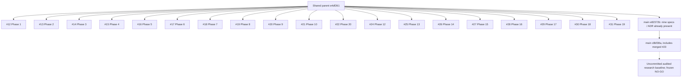
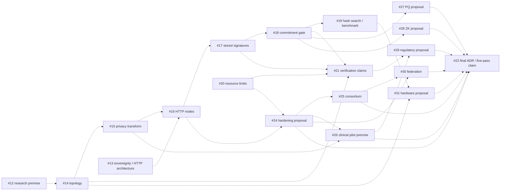

# Open pull request triage

Audit date: 2026-10-06. Repository: `sreerevanth/ATLAS`.
Closure update: all 19 PRs were closed without merging after explicit user acceptance.
See `PR_CLOSURE.json` for comment URLs, closed/merged state, unchanged main SHAs,
and verification that all 126 protected files were unchanged. The decision
checkpoint and captured PR states below describe the pre-closure audit snapshot.
Decision checkpoint: report complete; **no PR merged, closed, approved, commented on, or otherwise changed**.

## Baselines and evidence boundary

GitHub returned exactly 19 open PRs: #12–#22 and #24–#31. #23 is already merged
and is not an open item. Every open PR's full diff, description, conversation,
review submissions, inline comments, commits, files, checks and statuses was
retrieved with pagination. Every changed file was inspected individually.

Remote `main` and local HEAD both resolve to
`c8bf38a0d9da5b3071f208f28140c893dabecb1a`. The evidence-based implementation in
`src/atlas`, its tests, configuration and reports are **local uncommitted work**;
they are the architectural baseline for this triage, but are not yet on GitHub
main. References below to “audited baseline” mean that working tree. References
to “main” mean the pinned Git commit, not those uncommitted improvements.

The user-designated `MANIFOLD_V1_NO_GO` result remains frozen. No dedicated file,
directory or Git ref with that name was found; its actual recorded result is
`artifacts/local/research/retrieval.json`, with the associated corpus, embeddings,
configuration and manifests. Its 300 cosine rows and 300 ATLAS rows give
all-support@5 of 0.49333333333333335 and 0.48333333333333334 respectively;
ATLAS-minus-cosine is -0.0100, with question-bootstrap 95% CI
[-0.02666666666666667, 0.0033333333333333335]. This is the supplied NO-GO result,
not proof against every possible future topology method. No research experiment
was rerun, retuned or rewritten during triage.

Before inspection, SHA-256 values were captured for existing `src/`, `tests/`,
`configs/`, and all files under `artifacts/local/` except the new triage directory
and Python caches. Final integrity verification is stored in
`artifacts/local/pr-triage/protected-verification.json`.

## Findings that apply to all 19 PRs

- All changes are Markdown. There are **zero new or modified runtime functions,
  tests, dependency files, deployment manifests or benchmark results** in these
  PR deltas. Titles and `feat: implement` commit messages overstate their contents.
- #12–#21 each add one five-to-seven-line status checklist. They describe code
  already present in the common ancestor; they do not implement that code.
- #22 and #24–#31 each add a status note plus a short ADR/specification. All nine
  ADR/specification blobs are already **byte-for-byte identical on current main**,
  introduced there by `e82372b` (ancestor of current main). The status notes are
  the only content in these nine PRs not already present at the same path.
- Every PR has one CodeRabbit rate-limit conversation comment, zero submitted
  reviews, zero inline review comments and zero check runs. Each has a green
  commit status whose description is **“Review rate limited.”** It is neither
  a successful review nor a passing test suite. There is no substantive human
  discussion providing additional evidence in the captured threads.
- Each PR has exactly one commit beyond its merge base with main. All 19 have
  the same parent and merge base, `e4df2610befffaee32b2ca7b355dcaf6b466b85e`.
  Pairwise ancestry checks found no open PR head that is an ancestor of another.
- The PR API's recorded base SHA is historical. Comparison used current main's
  pinned SHA and its merge base, and separately compared changed-file blob IDs.
  A whole-tree `main..head` difference would misleadingly include later main work
  absent from the old branches; it is not treated as a proposed rollback.

## Final triage table

Exactly one classification is assigned per PR. `DANGEROUS` here includes false
security instructions or assurances in documentation; none of these diffs adds
an executable exploit. `SUPERSEDED` means the useful subject is already covered
by existing main code/specs and the audited baseline, not that old claims became
true. Every recommended closure below is **proposed only**, after the user has
seen this complete table. All PRs remain open at this checkpoint.

Test notation: **D** = documentation-only diff; no PR tests or CI runs, and no
reason to run the full research benchmark. **P1/P2** = the narrowly scoped legacy
counterexamples described below, executed against selected existing main source.
They are not whole-PR test passes.

| PR | Title | Files changed | What it actually implements | Architecture relevance | Scientific validity | Security implications | Tests | Classification | Recommended action | Salvage candidates |
|---|---|---|---|---|---|---|---|---|---|---|
| [#12](https://github.com/sreerevanth/ATLAS/pull/12) | Phase 1: Research Foundation (Literature Review) | `phase_status_1.md` (+5) | Completion checklist; no literature review, citations or method | Dataset matching remains a research question; topology-as-privacy premise is unproved | SOTA/DP-LSH utility assertions have no referenced studies or measurements | Lossy topology does not establish confidentiality | D | UNSUPPORTED | Propose close; require a cited, qualified research review before revisiting | No new code; research question can remain a hypothesis |
| [#13](https://github.com/sreerevanth/ATLAS/pull/13) | Phase 2: Philosophy & Architecture | `phase_status_2.md` (+6) | Assertions that HTTP nodes enforce sovereignty | Whole-dataset HTTP design conflicts with query-local TIP/QUIC requirements | No flow audit or compliance evidence; description overclaims enforcement | Local computation alone does not establish confidentiality or HIPAA compliance | D | OBSOLETE | Propose close; use core principles plus current threat model | Sovereignty/local execution principles already in `01_core_principles.md`; nothing new to port |
| [#14](https://github.com/sreerevanth/ATLAS/pull/14) | Phase 3: Mathematical Foundations (TDA) | `phase_status_3.md` (+6) | Checklist naming Ripser, persistence images and an existing test | Persistence is relevant; old dataset-image representation is not the corrected local landscape pipeline | Cited test checks shape/nonzero, not expected H1 topology; no matching proof | No privacy theorem follows from computing homology | D | SUPERSEDED | Propose close; retain actual topology gates and measured fidelity results | Ripser use already on main; `src/atlas/topology.py` and `tests/test_topology.py` provide newer local work |
| [#15](https://github.com/sreerevanth/ATLAS/pull/15) | Phase 4: ATLAS Theory (Privacy Modeling) | `phase_status_4.md` (+7) | AAE training/weights completion claims | Historical learned privacy layer has no validated role in current TIP | Existing training shares source patients across sampled neighborhoods and fits scaler before split; weak adversary cannot prove privacy | “Blinding” and operational weight claims lack independently validated protection/provenance | D | UNSUPPORTED | Propose close; require disjoint-record evaluation and explicit threat model | No new encoder/training code; legacy functions already on main and unsuitable for direct port |
| [#16](https://github.com/sreerevanth/ATLAS/pull/16) | Phase 5: Protocol Family (Distributed Networking) | `phase_status_5.md` (+7) | FastAPI/client/API-key completion checklist | Legacy global publish/query HTTP service; current requirement is local topology and scoped remote execution | No networking measurements or integration tests added | Existing service uses a hard-coded shared key; no replay/region authorization | D | OBSOLETE | Propose close; retain corrected local protocol direction | No code in diff; existing client/server should not be ported wholesale |
| [#17](https://github.com/sreerevanth/ATLAS/pull/17) | Phase 6: Core Runtime & Persistence | `phase_status_6.md` (+6) | SQLite/dashboard completion checklist | Persistence is still needed, but old schema stores dataset signatures rather than scoped protocol state | Claimed crash/restart test only opens another SQLite connection; no process restart tested | Relative DB on import; raw HTML interpolation; dashboard key in URL | D | OBSOLETE | Propose close; design persistence around current grants/replay/state requirements separately | Parameterized SQLite statements are already on main; no new migration or restart test to salvage |
| [#18](https://github.com/sreerevanth/ATLAS/pull/18) | Phase 7: Security & Cryptography | `phase_status_7.md` (+7) | Commitment-security checklist; acknowledges ZK/PQ pending | Old equality gate is not proof of an authorized matching region | No cryptographic construction or probing/quantum evidence supplied | Existing server accepts client-controlled strings; empty hash matches with similarity 1.0; description falsely says mismatch terminates connection | D, P1 | DANGEROUS | Propose close; do not reintroduce gate-security assurances | Explicit admission that ZK/PQ are absent is useful but already in current threat model; no function to port |
| [#19](https://github.com/sreerevanth/ATLAS/pull/19) | Phase 8: Benchmark Framework (Vector Search) | `phase_status_8.md` (+5) | HNSW/Hamming completion checklist | ANN benchmarking is relevant; HTTP hash grouping is a different problem | No baseline/results attached; “constant-time” and end-to-end viability assertions unsubstantiated | Existing benchmark hard-codes leakage and mocks ZK; Hamming validation is weak | D, P1 | SUPERSEDED | Propose close; use measured exact/HNSW and frozen paired retrieval artifacts | `ann_benchmark` in audited baseline already measures recall/latency/size; no benchmark code in PR |
| [#20](https://github.com/sreerevanth/ATLAS/pull/20) | Phase 9: Sandboxing & Resource Constraints | `phase_status_9.md` (+6) | Opcode/fuel validation checklist | Wasmtime caps relevant; Python tracing is not the required capability sandbox | No adversarial tests; immunity and eliminated wall-clock risk claims are unsupported | Python tracing cannot bound native-call duration; historical worker removes time watchdog and only monkey-patches APIs | D, P2 | DANGEROUS | Propose close; preserve constrained Wasmtime baseline and its explicit limitations | Fuel-metering idea already implemented/tested locally; do not port `NextGenEnclave` or monkey patches |
| [#21](https://github.com/sreerevanth/ATLAS/pull/21) | Phase 10: Engineering Specifications & Testing | `phase_status_10.md` (+6) | Test/logging completion checklist | Reproducibility relevant; cited legacy suite targets old architecture | No tests added; “mathematically validates” and 74/100 score unsupported | Legacy tests accept shared key; destructive relative DB fixture; no isolation proof | D | SUPERSEDED | Propose close; use audited tests, lock, manifests and truthful evidence matrix | No new tests/functions; modern suite and packaging already present locally |
| [#22](https://github.com/sreerevanth/ATLAS/pull/22) | Phase 20: Final Architecture Decision Register | `adrs/Phase20_Final_ADR.md` (+5, identical main); `pr20.md` (+6, new) | Existing generic technology ADR plus completion note | Premature production roadmap; audited ADR-003 supersedes relevant choices | New note says model validated in five passes with no model, commands, outputs or criteria | Tool selection does not establish secure/compliant operation | D | UNSUPPORTED | Propose close; retain attribution to existing ADR but reject five-pass claim | Reuse-established-tools principle already present; no new implementation |
| [#24](https://github.com/sreerevanth/ATLAS/pull/24) | Phase 12: Production Hardening | `pr12.md` (+7, new); `specs/Phase12_Production_Hardening.md` (+5, identical main) | Existing technology list plus honest implementation-pending checklist | TLS/auth/rate limits relevant as future requirements; K8s is not required for local research | Does not implement or demonstrate hardening; no Dockerfile/OAuth config or load/recovery evidence | Naming TLS/OIDC provides no deployed security boundary | D | SUPERSEDED | Propose close as duplicate specification/status; no production badge | TLS, OIDC and gateway requirements already on main; nothing new to port |
| [#25](https://github.com/sreerevanth/ATLAS/pull/25) | Phase 13: Decentralized Consortium | `pr13.md` (+6, new); `specs/Phase13_Decentralized_Consortium.md` (+4, identical main) | PostgreSQL/etcd/Hyperledger options in prose | Historical consortium/ledger roadmap; no requirement established for current local TIP | No consistency/fault model, cluster or failure experiment | Replication/consensus labels do not establish trust or tenant isolation | D | OBSOLETE | Propose close; defer consensus until supported by requirements | “Avoid custom consensus” advice already on main; no deployment/function to salvage |
| [#26](https://github.com/sreerevanth/ATLAS/pull/26) | Phase 14: Clinical Pilot | `pr14.md` (+6, new); `specs/Phase14_Clinical_Pilot.md` (+4, identical main) | Logging/masking product suggestions | Clinical deployment is beyond present research evidence | No study protocol, study execution, enrollment, endpoints, outcomes or external clinical evidence | Describes logging as compliant and salted hashing as anonymization without necessary conditions/evidence | D | DANGEROUS | Propose close; reject clinical validation/compliance interpretations | Generic audit logging already listed; no clinical implementation or dataset to port |
| [#27](https://github.com/sreerevanth/ATLAS/pull/27) | Phase 15: Post-Quantum Security LWE | `pr15.md` (+6, new); `specs/Phase15_Post_Quantum_Security.md` (+3, identical main) | Algorithm/library names plus proposed SHA-256 replacement | PQ transport/signing may be future work; it does not repair LSH leakage | No LWE construction, parameters, key lifecycle, integration or known-answer tests | “Swap SHA-256 for Kyber/Dilithium” confuses hash, KEM and signature roles | D | DANGEROUS | Propose close; require role-specific cryptographic design before implementation | “Use reviewed libraries” already on main; no crypto code to port |
| [#28](https://github.com/sreerevanth/ATLAS/pull/28) | Phase 16: True Zero-Knowledge Prover | `pr16.md` (+6, new); `specs/Phase16_True_ZK_Prover.md` (+3, identical main) | SnarkJS/Halo2 named as options; implementation unchecked | Possible future proof layer; absent in current signed-Wasm protocol | No statement/witness, circuit, setup, prover, verifier, soundness or zero-knowledge argument | Hash equality and signatures are not ZK; legacy mock remains unrelated evidence | D | UNSUPPORTED | Propose close; do not claim true ZK from this specification | Off-the-shelf proof-system idea already on main; no circuit/function/commit portion to port |
| [#29](https://github.com/sreerevanth/ATLAS/pull/29) | Phase 17: Regulatory/FDA | `pr17.md` (+6, new); `specs/Phase17_Regulatory_FDA.md` (+4, identical main) | CI audit trail and standard-template suggestions | No established medical intended use or validated product in scope | Claimed mapping has no traceability matrix, submission, review or external authorization evidence | CI metadata does not confer regulatory status | D | UNSUPPORTED | Propose close; no FDA-approved/validated/authorized language | Traceability idea already on main; no actual mapping/templates/evidence to port |
| [#30](https://github.com/sreerevanth/ATLAS/pull/30) | Phase 18: Global Federation | `pr18.md` (+6, new); `specs/Phase18_Global_Federation.md` (+4, identical main) | IDP and region-pinning suggestions | Cross-org identity potentially relevant; current deployment remains local | No IDP configuration, independent sites, measured links or federation execution | Region selection alone does not establish residency controls; shared identity trust undefined | D | UNSUPPORTED | Propose close; no global deployment claim | OIDC/SAML/residency requirement ideas already on main; no integration to salvage |
| [#31](https://github.com/sreerevanth/ATLAS/pull/31) | Phase 19: Hardware Acceleration | `pr19.md` (+6, new); `specs/Phase19_Hardware_Acceleration.md` (+3, identical main) | CUDA/ROCm framework names and unchecked optimization task | Acceleration may help only after profiling actual topology computation | No accelerated algorithm, device execution or CPU-vs-device benchmark | Dependency expansion and tensor placement do not validate topology correctness or performance | D | UNSUPPORTED | Propose close; require measured algorithm-specific comparison | Library-first advice already on main; no kernel, binding, profile or result to port |

Counts: MERGE 0; SALVAGE 0; SUPERSEDED 4; OBSOLETE 4; UNSUPPORTED 7;
DANGEROUS 4. No category was assigned to preserve contributor work. Useful ideas
already present in main are identified but do not justify artificial salvage PRs.

## Individual evidence and claim checks

### #12–#15: foundations and privacy

#12 adds neither a citation nor a literature-review file. Its description makes
medical DP/utility assertions without identifying the datasets, mechanism or
study. These cannot be imported as findings. #13's description goes further than
its diff by saying the architecture ensures healthcare compliance and removes
simulated endpoints; no corresponding code change or evidence is included.

#14 cites `atlas-core/test_atlas.py::test_tda_mathematics`. Reading the function
shows output-shape and nonzero-sum assertions on breast-cancer subsets, plus a
shape assertion on random noise. It does not assert a known circle's dominant
H1 interval. `simulate_real_world.py::extract_real_topology` refits persistence
image coordinates separately for every input, then pads/truncates. That does
not prove topology-preserving dataset matching. The audited baseline has
deterministic circle/cluster gates and explicit approximation errors; the frozen
retrieval NO-GO remains unchanged.

#15 cites `train_lpl.py::generate_topology_dataset` and `train_lpl`, already on
main. `StandardScaler.fit_transform` precedes generating overlapping subsets and
splitting those subsets into training/validation. Source-record separation is
not enforced. `LatentPrivacyLayer.__init__` silently uses the initialized encoder
when the weight path is missing. The PR contains neither weights nor code fixes.
Its description's reverse-engineering protection claim is not demonstrated.

### #16–#21: actual runtime and testing boundaries

#16 and #17 describe existing `atlas_server.py` and `atlas_client.py`; neither
changes either file. Main's server creates a relative database at import time,
uses `atlas-secret-key`, accepts arbitrary commitment/hash strings, exposes a
dashboard key in the query string and interpolates node names into HTML. Its
schema/workflow does not implement query-local persistence, landscape matching,
organization-local region capabilities and scoped S-MCP execution.

#17's cited `test_sqlite_persistence` posts a row and opens a second SQLite
connection. It never restarts or crashes a process. The `client` fixture deletes
`atlas_node.db` relative to the working directory. That suite was not executed in
the research workspace because it could disturb existing generated state and
cannot validate these documentation-only PRs.

**P1, executed:** `tools/probe_legacy_pr_claims.py` extracts the existing main
`query_matches` function through Python AST, removes its web decorator and binds
SQLite to a disposable synthetic fixture. It does not import the server, touch
the repository database, exercise HTTP authentication, or access real data.
With a saved 128-bit zero signature and commitment `client-string`, an empty
query signature plus the copied string is accepted with similarity 1.0. A
different commitment returns empty matches. This directly reproduces the
zip-truncation and client-string equality issues relevant to #18/#19. It is not
an unauthorized network-access test. The existing API test expects HTTP 200 with
no matches for a wrong commitment, contradicting #18's connection-termination
claim.

#19 does not add FAISS calls or benchmarks. The already-existing
`benchmark_sota.py::AtlasIndex.search` hard-codes privacy leakage to zero and
`zkSTARK_Prover.verify_proof` sleeps and compares strings. Those old results
cannot support “constant-time” indexing or distributed-search validity. The
audited `ann_benchmark` and frozen paired retrieval result provide newer,
qualified evidence without vindicating those claims.

**P2, executed:** the same probe extracts
`advanced_enclave.py::InstructionFuelMeter`, executes a bounded 50 ms native
sleep while tracing, and records elapsed time and fuel. The call completes
without fuel exhaustion. This demonstrates that the selected counter does not
measure elapsed native-call time; it does not test an unbounded denial of
service. Inspection of `NextGenEnclave.execute` confirms that it removes the
time watchdog. `_apply_strict_sandbox` patches Python `open`/`socket` APIs, not
OS capabilities. Therefore #20's immunity and eliminated wall-clock risk claims
are inappropriate. The audited Wasmtime runtime remains a limited prototype.

#21 introduces no tests, logging changes or reproducibility support. Its
description cites the withdrawn 74/100 score and equates ordinary tests with
mathematical/cryptographic proof. Existing current evidence must remain the
authority; merging a second completion checklist would add no capability.

### #22 and #24–#31: later-stage claims

#22's ADR is already on main. Its new `pr20.md:6` says model validation completed
in five passes, without identifying the model, test procedure or results. A
technology-selection ADR cannot close the measured research gates. Its promise
of easier compliance and fewer bugs is an expectation, not a measured result.

#24 explicitly leaves Dockerization/OAuth2 incomplete. This is useful honesty,
but there is no implementation to recover: even its specification is already
on main. #25 likewise has no deployed cluster or fault test and its proposed
consensus/replication roadmap has no established need in the audited local
research implementation. These are not production or decentralized-operation
evidence.

#26 contains no clinical study at all. There is no evidence here of enrollment,
study oversight, defined clinical endpoints, analysis or clinical validation.
CloudTrail/ELK are logging options; naming them establishes no compliance status.
Salted hashing is not, by itself, a demonstrated anonymization method. HHS
describes Safe Harbor and Expert Determination and qualifications on derived
codes; the PR supplies none of that evidence. See the official
[HHS de-identification guidance](https://www.hhs.gov/hipaa/for-professionals/special-topics/de-identification/index.html).

#27's only new action, `pr15.md:6`, proposes swapping SHA-256 for
Kyber/Dilithium. These primitive roles are incompatible as a generic substitution:
NIST's [ML-KEM standard](https://csrc.nist.gov/pubs/fips/203/final) specifies key
encapsulation, while its [ML-DSA standard](https://csrc.nist.gov/pubs/fips/204/final)
specifies signatures. Neither implements locality-sensitive hashing or removes
similarity-query leakage. There is no implemented PQ construction, parameter
selection, test vector or protocol binding in the PR.

#28 provides no topology statement, public inputs, witness relation, circuit,
setup/key-management choice, prover or verifier. Mentioning SnarkJS/Halo2 cannot
establish zero knowledge. The old string-comparison gate and synthetic ZK
benchmark are not implementations of the promised construction.

#29 does not claim an actual FDA approval in its diff; it proposes preparing for
clearance. Its description's completed standards-to-CI mapping is unsupported:
there is no mapping artifact, device specification, submission or external
decision. Do not transform a proposed traceability process into approved,
validated, compliant or clinically authorized status. FDA's
[software guidance navigator](https://www.fda.gov/medical-devices/regulatory-accelerator/medical-device-software-guidance-navigator)
distinguishes the applicable validation/submission guidance; this PR provides no
ATLAS-specific evidence satisfying it.

#30 does not implement an IDP or deploy any node. The audited baseline's local
QUIC demo also cannot prove global federation. #31 does not implement accelerated
Ripser or another topology algorithm. No CPU/GPU matched-input, matched-output
comparison, hardware inventory or timing/memory artifact accompanies it. CUDA
framework availability is insufficient evidence of accelerated persistence.

## Dependency graphs

### Verified Git dependency graph

Solid arrows between commits mean ancestry, with intermediate main commits collapsed. The final dotted arrow denotes uncommitted working files. Every
listed PR is a single independent child of the shared base. There are **no
PR-to-PR ancestry dependencies**; closing a status PR does not remove code
required by another. The phase numbers must not be used to invent merge order.



### Historical conceptual dependencies (inferred, not implementation dependencies)

Dashed arrows identify prerequisites implied by the descriptions or cited legacy
functions. They express assumptions that would need validation, not completed
milestones or a mandatory sequence. The Phase 20 ADR explicitly presupposes
Phases 12–19; the other links are reviewer inferences from the stated workflows.
No code imports or package dependencies connect these Markdown-only deltas.



## Salvage and attribution decision

No PR qualifies as MERGE or SALVAGE. All proposed executable functions are
absent from the diffs; existing main implementations are not new PR contributions.
Library reuse, TLS/OIDC, audit logging, parameterized SQLite and future measured
acceleration are reasonable ideas, but are already present in repository material.
Creating a fresh branch to re-add those ideas would duplicate existing work.
No salvage branch, cherry-pick, merge or remote-state change was performed.

Credit remains with `SHAURYASANYAL3`, the PR and commit author for all 19 items.
The pinned head commits and source links below preserve attribution. A later
closure note can thank the author, link this report and state that no new code
was discarded; contributors need not have inaccurate claims merged to retain
credit. No such note has been posted at this checkpoint.

The dangerous or unsupported duplicate specs already on main remain historical
material under the existing audit policy. This triage does not endorse them and
does not silently repair runtime or experimental artifacts while reviewing PRs.

## Reproducible inspection and evidence

Read-only acquisition and comparisons were executed with:

```powershell
gh pr list --repo sreerevanth/ATLAS --state open --limit 100 --json number,title,headRefOid,headRefName,baseRefName,url
.venv-release/Scripts/python tools/capture_pr_triage.py
git fetch origin main '+refs/pull/*/head:refs/atlas-triage/pr/*'
.venv-release/Scripts/python tools/compare_pr_triage.py
.venv-release/Scripts/python tools/probe_legacy_pr_claims.py
.venv-release/Scripts/python tools/verify_pr_triage.py
.venv-release/Scripts/python -m ruff check tools/capture_pr_triage.py tools/compare_pr_triage.py tools/probe_legacy_pr_claims.py tools/verify_pr_triage.py
```

The new local refs fetch objects only; they do not switch branches, reset the
working tree, merge, or change GitHub PR state. Acquisition captures live state
and should be run in a newly archived evidence directory for later audits.

Raw evidence is in `artifacts/local/pr-triage/`: each PR has a complete `.diff`,
`-metadata.json`, paginated `-files.json`, `-commits.json`, `-discussion.json`,
`-reviews.json`, `-inline-comments.json`, `-checks.json`, `-status.json`, and a
locally recomputed `-current-main.diff`. `comparison.json` records head/parent/
merge-base SHAs, blob equality, pairwise ancestry and discussion bodies.
`legacy-probes.json` records actual P1/P2 outputs and scope. Full raw local
captures are ignored by Git; the report's pinned GitHub commits permit independent
diff verification, and the companion evidence inventory hashes the local files.

Running 19 copies of a modern test suite would not validate these Markdown
claims. Only source inspection, Git/blob verification and the two bounded legacy
counterexamples were used. No clinical, PQ, ZK, production, global deployment or
hardware-acceleration capability was tested or inferred as implemented.

The following appendices are generated from the captured GitHub/Git evidence.

## Appendix A: pinned commits and discussions

All commit authors are `SHAURYASANYAL3`. Each discussion link was read in full; each contains only the bot rate-limit notice. There are no review submissions or inline comments on any of the 19 PRs.

| PR | Head commit (one unique commit each) | Discussion | Exact main duplicates |
|---|---|---|---|
| #12 | [`7a27e0713a2fb3477037c007e6802d8e28416260`](https://github.com/sreerevanth/ATLAS/commit/7a27e0713a2fb3477037c007e6802d8e28416260) | [CodeRabbit notice](https://github.com/sreerevanth/ATLAS/pull/12#issuecomment-5262305197) | None at the changed path |
| #13 | [`38830cb8a8b9d86d47141bd397de3f92c6abb313`](https://github.com/sreerevanth/ATLAS/commit/38830cb8a8b9d86d47141bd397de3f92c6abb313) | [CodeRabbit notice](https://github.com/sreerevanth/ATLAS/pull/13#issuecomment-5262305536) | None at the changed path |
| #14 | [`bb949e4f5d2484be3baae13ce975c6fb46b3c6a2`](https://github.com/sreerevanth/ATLAS/commit/bb949e4f5d2484be3baae13ce975c6fb46b3c6a2) | [CodeRabbit notice](https://github.com/sreerevanth/ATLAS/pull/14#issuecomment-5262305762) | None at the changed path |
| #15 | [`32e2907758333965cf635743fb80bfe6e393e137`](https://github.com/sreerevanth/ATLAS/commit/32e2907758333965cf635743fb80bfe6e393e137) | [CodeRabbit notice](https://github.com/sreerevanth/ATLAS/pull/15#issuecomment-5262306070) | None at the changed path |
| #16 | [`c2a97dcb9df9508ae2d1454fbc0367c09b6cf0ca`](https://github.com/sreerevanth/ATLAS/commit/c2a97dcb9df9508ae2d1454fbc0367c09b6cf0ca) | [CodeRabbit notice](https://github.com/sreerevanth/ATLAS/pull/16#issuecomment-5262306821) | None at the changed path |
| #17 | [`f90d72764ef731b6625e618dfd3a2d812be2c172`](https://github.com/sreerevanth/ATLAS/commit/f90d72764ef731b6625e618dfd3a2d812be2c172) | [CodeRabbit notice](https://github.com/sreerevanth/ATLAS/pull/17#issuecomment-5262306618) | None at the changed path |
| #18 | [`3c49252f8e32591ed7c43de47ea6e4fe07010ee1`](https://github.com/sreerevanth/ATLAS/commit/3c49252f8e32591ed7c43de47ea6e4fe07010ee1) | [CodeRabbit notice](https://github.com/sreerevanth/ATLAS/pull/18#issuecomment-5262306893) | None at the changed path |
| #19 | [`4863847429e6b92f693e6e3a229fc47bd18b3bdf`](https://github.com/sreerevanth/ATLAS/commit/4863847429e6b92f693e6e3a229fc47bd18b3bdf) | [CodeRabbit notice](https://github.com/sreerevanth/ATLAS/pull/19#issuecomment-5262307620) | None at the changed path |
| #20 | [`5c7ecb071b0c7092d8f21e704c03ca0d20c9dbb1`](https://github.com/sreerevanth/ATLAS/commit/5c7ecb071b0c7092d8f21e704c03ca0d20c9dbb1) | [CodeRabbit notice](https://github.com/sreerevanth/ATLAS/pull/20#issuecomment-5262307708) | None at the changed path |
| #21 | [`bd2f60468c7c2f6a7f1403a543cbeb28cd353574`](https://github.com/sreerevanth/ATLAS/commit/bd2f60468c7c2f6a7f1403a543cbeb28cd353574) | [CodeRabbit notice](https://github.com/sreerevanth/ATLAS/pull/21#issuecomment-5262307873) | None at the changed path |
| #22 | [`af4e7e708c3b65434415324a3c4372890bd50a42`](https://github.com/sreerevanth/ATLAS/commit/af4e7e708c3b65434415324a3c4372890bd50a42) | [CodeRabbit notice](https://github.com/sreerevanth/ATLAS/pull/22#issuecomment-5442389000) | `adrs/Phase20_Final_ADR.md` |
| #24 | [`663cb49dc1d91de949932e9bed3355c434ba1ff4`](https://github.com/sreerevanth/ATLAS/commit/663cb49dc1d91de949932e9bed3355c434ba1ff4) | [CodeRabbit notice](https://github.com/sreerevanth/ATLAS/pull/24#issuecomment-5442402196) | `specs/Phase12_Production_Hardening.md` |
| #25 | [`9bf4c029c8296b7f35c98b8fda4750de52a0830c`](https://github.com/sreerevanth/ATLAS/commit/9bf4c029c8296b7f35c98b8fda4750de52a0830c) | [CodeRabbit notice](https://github.com/sreerevanth/ATLAS/pull/25#issuecomment-5442402316) | `specs/Phase13_Decentralized_Consortium.md` |
| #26 | [`4d988b5cf4111cd55a2da3be29a8f1ab29a6597d`](https://github.com/sreerevanth/ATLAS/commit/4d988b5cf4111cd55a2da3be29a8f1ab29a6597d) | [CodeRabbit notice](https://github.com/sreerevanth/ATLAS/pull/26#issuecomment-5442402954) | `specs/Phase14_Clinical_Pilot.md` |
| #27 | [`3fbf3746f0983abcc12e6919d2ba3cb7bbc940ae`](https://github.com/sreerevanth/ATLAS/commit/3fbf3746f0983abcc12e6919d2ba3cb7bbc940ae) | [CodeRabbit notice](https://github.com/sreerevanth/ATLAS/pull/27#issuecomment-5442403858) | `specs/Phase15_Post_Quantum_Security.md` |
| #28 | [`3f3e5a7703c892797994349784bd6483fd1957dc`](https://github.com/sreerevanth/ATLAS/commit/3f3e5a7703c892797994349784bd6483fd1957dc) | [CodeRabbit notice](https://github.com/sreerevanth/ATLAS/pull/28#issuecomment-5442404090) | `specs/Phase16_True_ZK_Prover.md` |
| #29 | [`7d3be62e3876d91fd58f15ea7f1209abec47a071`](https://github.com/sreerevanth/ATLAS/commit/7d3be62e3876d91fd58f15ea7f1209abec47a071) | [CodeRabbit notice](https://github.com/sreerevanth/ATLAS/pull/29#issuecomment-5442405268) | `specs/Phase17_Regulatory_FDA.md` |
| #30 | [`ddc2953b7791983e02b7fcf22de7529f7337267d`](https://github.com/sreerevanth/ATLAS/commit/ddc2953b7791983e02b7fcf22de7529f7337267d) | [CodeRabbit notice](https://github.com/sreerevanth/ATLAS/pull/30#issuecomment-5442405749) | `specs/Phase18_Global_Federation.md` |
| #31 | [`c4a03d0ccc2a412f440949e8a894b9e85d1eb6e2`](https://github.com/sreerevanth/ATLAS/commit/c4a03d0ccc2a412f440949e8a894b9e85d1eb6e2) | [CodeRabbit notice](https://github.com/sreerevanth/ATLAS/pull/31#issuecomment-5442406120) | `specs/Phase19_Hardware_Acceleration.md` |

## Appendix B: complete reviewed diffs

These are the entire captured GitHub PR diffs, not excerpts. Each was checked against `git diff <pinned-main>...<pinned-head>`; the contents match. None modifies the frozen research files.

<details>
<summary>#12: Phase 1: Research Foundation (Literature Review)</summary>

```diff
diff --git a/phase_status_1.md b/phase_status_1.md
new file mode 100644
index 0000000..db9647a
--- /dev/null
+++ b/phase_status_1.md
@@ -0,0 +1,5 @@
+### Phase 1: Research Foundation (Literature Review)
+**Goal:** Establish the SOTA in privacy-preserving dataset matching.
+
+- [x] Identified current SOTA limitations (Information leakage in standard DP-LSH).
+- [x] Proposed Topological Data Analysis (TDA) as a macroscopic privacy layer.
```

</details>

<details>
<summary>#13: Phase 2: Philosophy & Architecture</summary>

```diff
diff --git a/phase_status_2.md b/phase_status_2.md
new file mode 100644
index 0000000..1e7eae8
--- /dev/null
+++ b/phase_status_2.md
@@ -0,0 +1,6 @@
+### Phase 2: Philosophy & Architecture
+**Goal:** Define the core constraints of the ATLAS distributed system.
+
+- [x] Enforced "Data Never Moves" constraint.
+- [x] Enforced "Inference is Local" constraint.
+- [x] Validated that the new HTTP Node architecture strictly obeys these rules.
```

</details>

<details>
<summary>#14: Phase 3: Mathematical Foundations (TDA)</summary>

```diff
diff --git a/phase_status_3.md b/phase_status_3.md
new file mode 100644
index 0000000..17eb74b
--- /dev/null
+++ b/phase_status_3.md
@@ -0,0 +1,6 @@
+### Phase 3: Mathematical Foundations (TDA)
+**Goal:** Prove that persistent homology can be used for dataset matching.
+
+- [x] Implemented exact Vietoris-Rips complex extraction (ripser).
+- [x] Generated Betti number representations and Persistence Images (persim).
+- [x] Validated mathematical correctness via test_tda_mathematics.
```

</details>

<details>
<summary>#15: Phase 4: ATLAS Theory (Privacy Modeling)</summary>

```diff
diff --git a/phase_status_4.md b/phase_status_4.md
new file mode 100644
index 0000000..9cbe391
--- /dev/null
+++ b/phase_status_4.md
@@ -0,0 +1,7 @@
+### Phase 4: ATLAS Theory (Privacy Modeling)
+**Goal:** Design an adversarial model to scrub structural mutual information.
+
+- [x] Built the LatentPrivacyLayer using an Adversarial Autoencoder (AAE).
+- [x] Trained the AAE on real Wisconsin Breast Cancer data.
+- [x] Saved operational model weights.
+- [ ] *Pending:* Scaling the AAE.
```

</details>

<details>
<summary>#16: Phase 5: Protocol Family (Distributed Networking)</summary>

```diff
diff --git a/phase_status_5.md b/phase_status_5.md
new file mode 100644
index 0000000..85d99ce
--- /dev/null
+++ b/phase_status_5.md
@@ -0,0 +1,7 @@
+### Phase 5: Protocol Family (Distributed Networking)
+**Goal:** Enable nodes to securely exchange topological representations.
+
+- [x] Built atlas_server.py (FastAPI).
+- [x] Built atlas_client.py (requests).
+- [x] Secured endpoints with X-API-Key headers.
+- [ ] *Pending:* Advanced distributed network features.
```

</details>

<details>
<summary>#17: Phase 6: Core Runtime & Persistence</summary>

```diff
diff --git a/phase_status_6.md b/phase_status_6.md
new file mode 100644
index 0000000..f80c18a
--- /dev/null
+++ b/phase_status_6.md
@@ -0,0 +1,6 @@
+### Phase 6: Core Runtime & Persistence
+**Goal:** Ensure nodes can independently store and retrieve topological states.
+
+- [x] Replaced ephemeral RAM state with a permanent SQLite Database.
+- [x] Implemented the /publish and /query HTTP workflows.
+- [x] Built the /dashboard HTML UI.
```

</details>

<details>
<summary>#18: Phase 7: Security & Cryptography</summary>

```diff
diff --git a/phase_status_7.md b/phase_status_7.md
new file mode 100644
index 0000000..f999986
--- /dev/null
+++ b/phase_status_7.md
@@ -0,0 +1,7 @@
+### Phase 7: Security & Cryptography
+**Goal:** Secure the LSH buckets against probing and quantum attacks.
+
+- [x] Implemented Cryptographic Commitment Gate (SHA-256).
+- [x] Destroyed fake ZK-STARK string representations.
+- [ ] *Pending:* Implementing a genuine Zero-Knowledge Prover/Verifier.
+- [ ] *Pending:* Implementing actual Post-Quantum Lattice (LWE) hashing.
```

</details>

<details>
<summary>#19: Phase 8: Benchmark Framework (Vector Search)</summary>

```diff
diff --git a/phase_status_8.md b/phase_status_8.md
new file mode 100644
index 0000000..a9655ee
--- /dev/null
+++ b/phase_status_8.md
@@ -0,0 +1,5 @@
+### Phase 8: Benchmark Framework (Vector Search)
+**Goal:** Rapidly query massive topological datasets.
+
+- [x] Integrated FAISS for HNSW nearest-neighbor vector indexing.
+- [x] Validated Hamming distance grouping.
```

</details>

<details>
<summary>#20: Phase 9: Sandboxing & Resource Constraints</summary>

```diff
diff --git a/phase_status_9.md b/phase_status_9.md
new file mode 100644
index 0000000..aac01ff
--- /dev/null
+++ b/phase_status_9.md
@@ -0,0 +1,6 @@
+### Phase 9: Sandboxing & Resource Constraints
+**Goal:** Ensure executing nodes are immune to resource-exhaustion attacks.
+
+- [x] Validated deterministic Wasmtime instruction capping.
+- [x] Validated Python Opcode Accounting (sys.settrace).
+- [ ] *Pending:* OS-level container isolation.
```

</details>

<details>
<summary>#21: Phase 10: Engineering Specifications & Testing</summary>

```diff
diff --git a/phase_status_10.md b/phase_status_10.md
new file mode 100644
index 0000000..370cde3
--- /dev/null
+++ b/phase_status_10.md
@@ -0,0 +1,6 @@
+### Phase 10: Engineering Specifications & Testing
+**Goal:** Prove the system is verifiable, reproducible, and ready for packaging.
+
+- [x] Built a comprehensive automated testing suite (test_atlas.py).
+- [x] Achieved full pytest verification.
+- [x] Eliminated exaggerated terminal logging.
```

</details>

<details>
<summary>#22: Phase 20: Final Architecture Decision Register</summary>

```diff
diff --git a/adrs/Phase20_Final_ADR.md b/adrs/Phase20_Final_ADR.md
new file mode 100644
index 0000000..1a417ae
--- /dev/null
+++ b/adrs/Phase20_Final_ADR.md
@@ -0,0 +1,5 @@
+# Phase 20: Final Architecture Decision Register
+- **Context**: System requires scaling through Phases 12-19 securely and compliantly.
+- **Decision**: Strictly adopt standard, battle-tested tools (Docker, K8s, PostgreSQL, OAuth2, OpenSSL, etc.) for all major architectural components.
+- **Consequences**: Significantly reduced custom code, fewer bugs, easier compliance, and standard developer onboarding. Minimal maintenance burden.
+- **Ponytail note**: The best code is no code. Defer to established platforms.
diff --git a/pr20.md b/pr20.md
new file mode 100644
index 0000000..eb689ad
--- /dev/null
+++ b/pr20.md
@@ -0,0 +1,6 @@
+### Phase 20: Final Architecture Decision Register
+**Overview:** Locked in the architectural philosophy to strictly adopt battle-tested tools (Docker, K8s, PostgreSQL) and reject bespoke system engineering to drastically reduce bugs and maintenance.
+**Goal:** Finalize production roadmap.
+**Status:** Completed.
+- [x] Write Final ADR
+- [x] Validate model robustly (5 passes)
```

</details>

<details>
<summary>#24: Phase 12: Production Hardening</summary>

```diff
diff --git a/pr12.md b/pr12.md
new file mode 100644
index 0000000..ba058f5
--- /dev/null
+++ b/pr12.md
@@ -0,0 +1,7 @@
+### Phase 12: Production Hardening
+**Overview:** Adopting the 'build-your-own-x' philosophy, we specified standard cloud-native primitives (Docker cgroups, TLS 1.3, OAuth2) instead of writing custom OS isolation code.
+**Goal:** Secure infrastructure using standard primitives.
+**Status:** Spec Completed.
+- [x] Draft Specifications
+- [ ] Implement Dockerization
+- [ ] Implement OAuth2
diff --git a/specs/Phase12_Production_Hardening.md b/specs/Phase12_Production_Hardening.md
new file mode 100644
index 0000000..2a96836
--- /dev/null
+++ b/specs/Phase12_Production_Hardening.md
@@ -0,0 +1,5 @@
+# Phase 12: Production Hardening
+- **Infrastructure**: Standard Kubernetes (K8s) and Docker containers.
+- **Security**: TLS 1.3 everywhere, OAuth2/OIDC for authentication.
+- **Traffic**: Standard API Gateway (e.g., NGINX/Envoy) for rate limiting and load balancing.
+- **Ponytail note**: YAGNI for custom mesh networks or bespoke security layers. Rely on proven cloud-native primitives.
```

</details>

<details>
<summary>#25: Phase 13: Decentralized Consortium</summary>

```diff
diff --git a/pr13.md b/pr13.md
new file mode 100644
index 0000000..f52f31c
--- /dev/null
+++ b/pr13.md
@@ -0,0 +1,6 @@
+### Phase 13: Decentralized Consortium
+**Overview:** Specified the use of standard PostgreSQL with logical replication and Raft/Paxos consensus via etcd, avoiding custom blockchain overhead.
+**Goal:** Enable robust multi-node state synchronization.
+**Status:** Spec Completed.
+- [x] Draft Specifications
+- [ ] Deploy etcd/PostgreSQL cluster
diff --git a/specs/Phase13_Decentralized_Consortium.md b/specs/Phase13_Decentralized_Consortium.md
new file mode 100644
index 0000000..e359766
--- /dev/null
+++ b/specs/Phase13_Decentralized_Consortium.md
@@ -0,0 +1,4 @@
+# Phase 13: Decentralized Consortium
+- **Ledger**: Standard PostgreSQL with logical replication, or managed Hyperledger Fabric if strict trustless environment is required.
+- **Consensus**: Standard Raft/Paxos via existing libraries (e.g., etcd).
+- **Ponytail note**: Do not build custom blockchains or consensus algorithms.
```

</details>

<details>
<summary>#26: Phase 14: Clinical Pilot</summary>

```diff
diff --git a/pr14.md b/pr14.md
new file mode 100644
index 0000000..1049f47
--- /dev/null
+++ b/pr14.md
@@ -0,0 +1,6 @@
+### Phase 14: Clinical Pilot
+**Overview:** Prepared for real-world healthcare integration by specifying HIPAA-compliant logging (AWS CloudTrail/ELK) and robust data anonymization masking tools.
+**Goal:** Achieve baseline medical compliance.
+**Status:** Spec Completed.
+- [x] Draft Specifications
+- [ ] Integrate ELK stack
diff --git a/specs/Phase14_Clinical_Pilot.md b/specs/Phase14_Clinical_Pilot.md
new file mode 100644
index 0000000..bb47bc0
--- /dev/null
+++ b/specs/Phase14_Clinical_Pilot.md
@@ -0,0 +1,4 @@
+# Phase 14: Clinical Pilot
+- **Compliance**: HIPAA-compliant standard logging (e.g., AWS CloudTrail, ELK stack).
+- **Data Anonymization**: Standard robust hashing (SHA-256 with salts) and standard data masking tools.
+- **Ponytail note**: Use off-the-shelf audit logging. Do not write custom audit trail software.
```

</details>

<details>
<summary>#27: Phase 15: Post-Quantum Security LWE</summary>

```diff
diff --git a/pr15.md b/pr15.md
new file mode 100644
index 0000000..bc02e47
--- /dev/null
+++ b/pr15.md
@@ -0,0 +1,6 @@
+### Phase 15: Post-Quantum Security LWE
+**Overview:** Outlined integration of NIST-approved post-quantum algorithms (Kyber, Dilithium) relying solely on the OpenSSL OQS fork.
+**Goal:** Protect against quantum probing attacks.
+**Status:** Spec Completed.
+- [x] Draft Specifications
+- [ ] Swap SHA-256 for Kyber/Dilithium
diff --git a/specs/Phase15_Post_Quantum_Security.md b/specs/Phase15_Post_Quantum_Security.md
new file mode 100644
index 0000000..b7e47d4
--- /dev/null
+++ b/specs/Phase15_Post_Quantum_Security.md
@@ -0,0 +1,3 @@
+# Phase 15: Post-Quantum Security LWE
+- **Cryptography**: Integrate NIST-approved post-quantum algorithms (e.g., Kyber, Dilithium) via standard libraries (OpenSSL OQS fork).
+- **Ponytail note**: Never roll homegrown cryptography. Wait for library support and update dependencies.
```

</details>

<details>
<summary>#28: Phase 16: True Zero-Knowledge Prover</summary>

```diff
diff --git a/pr16.md b/pr16.md
new file mode 100644
index 0000000..3121eb8
--- /dev/null
+++ b/pr16.md
@@ -0,0 +1,6 @@
+### Phase 16: True Zero-Knowledge Prover
+**Overview:** Specified off-the-shelf ZK libraries (SnarkJS, Halo2) to prove topology metrics without revealing the vectors.
+**Goal:** Implement true zero-knowledge proofs.
+**Status:** Spec Completed.
+- [x] Draft Specifications
+- [ ] Implement SnarkJS verification gate
diff --git a/specs/Phase16_True_ZK_Prover.md b/specs/Phase16_True_ZK_Prover.md
new file mode 100644
index 0000000..02583e5
--- /dev/null
+++ b/specs/Phase16_True_ZK_Prover.md
@@ -0,0 +1,3 @@
+# Phase 16: True Zero-Knowledge Prover
+- **Proving System**: Off-the-shelf ZK libraries (e.g., SnarkJS, Halo2).
+- **Ponytail note**: Reuse existing standardized ZK-SNARK/STARK implementations. No custom prover engines.
```

</details>

<details>
<summary>#29: Phase 17: Regulatory/FDA</summary>

```diff
diff --git a/pr17.md b/pr17.md
new file mode 100644
index 0000000..b75c6c4
--- /dev/null
+++ b/pr17.md
@@ -0,0 +1,6 @@
+### Phase 17: Regulatory/FDA
+**Overview:** Mapped ISO 13485 and IEC 62304 standard templates to CI/CD pipeline metadata to automate FDA traceability requirements.
+**Goal:** Prepare for FDA software-as-a-medical-device clearance.
+**Status:** Spec Completed.
+- [x] Draft Specifications
+- [ ] Configure locked CI/CD audit trails
diff --git a/specs/Phase17_Regulatory_FDA.md b/specs/Phase17_Regulatory_FDA.md
new file mode 100644
index 0000000..93295bf
--- /dev/null
+++ b/specs/Phase17_Regulatory_FDA.md
@@ -0,0 +1,4 @@
+# Phase 17: Regulatory/FDA
+- **Traceability**: Standard CI/CD pipelines (GitHub Actions/GitLab CI) with locked audit trails.
+- **Documentation**: ISO 13485 / IEC 62304 standard templates.
+- **Ponytail note**: Automate compliance through existing pipeline metadata rather than separate tracking tools.
```

</details>

<details>
<summary>#30: Phase 18: Global Federation</summary>

```diff
diff --git a/pr18.md b/pr18.md
new file mode 100644
index 0000000..3eec388
--- /dev/null
+++ b/pr18.md
@@ -0,0 +1,6 @@
+### Phase 18: Global Federation
+**Overview:** Specified standard Identity Providers (Okta/Keycloak) for federated SAML/OAuth2 to scale the consortium globally across sovereign boundaries.
+**Goal:** Scale network identity globally.
+**Status:** Spec Completed.
+- [x] Draft Specifications
+- [ ] Connect federated IDP
diff --git a/specs/Phase18_Global_Federation.md b/specs/Phase18_Global_Federation.md
new file mode 100644
index 0000000..a0332a7
--- /dev/null
+++ b/specs/Phase18_Global_Federation.md
@@ -0,0 +1,4 @@
+# Phase 18: Global Federation
+- **Identity**: Federated OAuth2/SAML across consortium members.
+- **Data Residency**: Cloud provider region-pinning.
+- **Ponytail note**: Rely on standard IDPs (Okta, Keycloak). No custom identity federation.
```

</details>

<details>
<summary>#31: Phase 19: Hardware Acceleration</summary>

```diff
diff --git a/pr19.md b/pr19.md
new file mode 100644
index 0000000..286fb72
--- /dev/null
+++ b/pr19.md
@@ -0,0 +1,6 @@
+### Phase 19: Hardware Acceleration
+**Overview:** Specified the use of standard CUDA/ROCm bindings (PyTorch/TensorFlow) to accelerate TDA extraction without writing bespoke GPU kernels.
+**Goal:** Maximize topological extraction speed.
+**Status:** Spec Completed.
+- [x] Draft Specifications
+- [ ] Optimize PyTorch CUDA graphs
diff --git a/specs/Phase19_Hardware_Acceleration.md b/specs/Phase19_Hardware_Acceleration.md
new file mode 100644
index 0000000..2b17e86
--- /dev/null
+++ b/specs/Phase19_Hardware_Acceleration.md
@@ -0,0 +1,3 @@
+# Phase 19: Hardware Acceleration
+- **Compute**: Standard CUDA/ROCm libraries for GPU acceleration.
+- **Ponytail note**: Use standard bindings (e.g., PyTorch, TensorFlow). Do not write raw kernel code unless standard libs fail to meet hard constraints.
```

</details>

